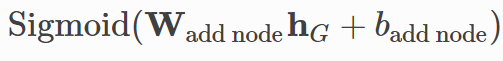

本文介绍图生成网络[Learning Deep Generative Models of Graphs](https://arxiv.org/pdf/1803.03324.pdf)（DGMG）。图生成网络的典型应用包括药物生成，图演化等。我们首先介绍图生成的基本算子，然后介绍如何利用这些算子生成图，最后介绍如何利用神经网络来实现这些算子。

## 生成图的主要算子

生成图主要算子有
* add_node_and_update. 判断是否添加一个节点到图中（如果判断为添加节点，则添加一个节点到图中）
* add_edge_or_not. 判断是否添加边
* choose_dest_and_update. (如果判断为添加边，)需要选择图中已有的一个节点，和最近添加的节点形成一条边。

下图演示了如何利用这3个算子生成图。


我们使用[Deep Graph Library](https://github.com/dmlc/dgl)(dgl)来演示添加节点和边生成一幅图。
```python
import dgl

g = dgl.DGLGraph()
# add_nodes(1) 表示添加一个节点，在dgl中节点的ID从0开始
# 添加第一个节点，ID为0
g.add_nodes(1)  # Add node 0
# 再添加一个节点，ID为1
g.add_nodes(1)  # Add node 1

# add_edges([1, 0], [0, 1])
# 第一个参数[1, 0]是两个源节点ID，第二个参数[0, 1]是两个目标节点ID
# 即添加了两条有向边node 1到node 0; node 0到node 1
# Edges in DGLGraph are directed by default.
# For undirected edges, add edges for both directions.
g.add_edges([1, 0], [0, 1])  # Add edges (1, 0), (0, 1)
g.add_nodes(1)  # Add node 2
g.add_edges([2, 1], [1, 2])  # Add edges (2, 1), (1, 2)
g.add_edges([2, 0], [0, 2])  # Add edges (2, 0), (0, 2)
```

## 利用生成图算子构图

我们先介绍预测阶段如何利用生成图算子构图，然后再介绍训练阶段。

### 预测阶段

在本论文中，作者使用如下的方法，生成图。
```python
def forward_inference(self):
    # 首先，判断是否需要添加节点，如果需要添加节点，则添加节点到图中，并返回结束标记stop=False
    # 如果不需要添加节点，则返回结束标记stop=True
    stop = self.add_node_and_update()
    # 判断是否结束，如果结束标记为True, 或者图中节点个数超过了设置的最大节点个数，则结束生成图的迭代过程。
    while (not stop) and (self.g.number_of_nodes() < self.v_max + 1):
        num_trials = 0
        # 判断是否需要添加一条边
        to_add_edge = self.add_edge_or_not()
        while to_add_edge and (num_trials < self.g.number_of_nodes() - 1):
            # 需要添加边，选择一个图中节点，与刚添加的节点构成一条边
            self.choose_dest_and_update()
            # 迭代次数加1，迭代次数超过图中节点数，停止添加边
            # 注意到如果图中有0， 1， 2个3个节点，最近添加的节点为2，当num_trials < 3 - 1时，停止迭代。即num_trials=0和1时进入循环，0和1恰好对应节点0和节点1。
            num_trials += 1
            to_add_edge = self.add_edge_or_not()
        stop = self.add_node_and_update()

    return self.g
```

### 训练阶段

上述为预测阶段生成图的流程，训练阶段多了一个参数actions。一个图的生成对应了一个actions。比如actions=[AddNodeAndUpdate=True, AddEdge=False, AddNode=True, AddEdge=True, ChooseDest=0],就可以生成包含两个节点，这两个节点有一条边的图。训练就是最大化这个actions序列的概率。


```python
def forward_train(self, actions):
    """
    - actions: list
        - Contains a_1, ..., a_T described above
    - self.prepare_for_train()
        - Initializes self.action_step to be 0, which will get
          incremented by 1 every time it is called.
        - Initializes objects recording log p(a_t|a_1,...a_{t-1})

    Returns
    -------
    - self.get_log_prob(): log p(a_1, ..., a_T)
    """
    self.prepare_for_train()

    stop = self.add_node_and_update(a=actions[self.action_step])
    while not stop:
        to_add_edge = self.add_edge_or_not(a=actions[self.action_step])
        while to_add_edge:
            self.choose_dest_and_update(a=actions[self.action_step])
            to_add_edge = self.add_edge_or_not(a=actions[self.action_step])
        stop = self.add_node_and_update(a=actions[self.action_step])

    return self.get_log_prob()
```

## 生成图架构（DGMG）

我们可以将DGMG生成图的架构（即本论文提出的架构），封装成一个抽象类。之后我们会继承这个类，进行具体实现。

```python
import torch.nn as nn


class DGMGSkeleton(nn.Module):
    def __init__(self, v_max):
        """
        Parameters
        ----------
        v_max: int
            Max number of nodes considered
        """
        super(DGMGSkeleton, self).__init__()

        # Graph configuration
        self.v_max = v_max

    def add_node_and_update(self, a=None):
        """Decide if to add a new node.
        If a new node should be added, update the graph."""
        return NotImplementedError

    def add_edge_or_not(self, a=None):
        """Decide if a new edge should be added."""
        return NotImplementedError

    def choose_dest_and_update(self, a=None):
        """Choose destination and connect it to the latest node.
        Add edges for both directions and update the graph."""
        return NotImplementedError

    def forward_train(self, actions):
        """Forward at training time. It records the probability
        of generating a ground truth graph following the actions."""
        return NotImplementedError

    def forward_inference(self):
        """Forward at inference time.
        It generates graphs on the fly."""
        return NotImplementedError

    def forward(self, actions=None):
        # The graph you will work on
        self.g = dgl.DGLGraph()

        # If there are some features for nodes and edges,
        # zero tensors will be set for those of new nodes and edges.
        self.g.set_n_initializer(dgl.frame.zero_initializer)
        self.g.set_e_initializer(dgl.frame.zero_initializer)

        if self.training:
            return self.forward_train(actions=actions)
        else:
            return self.forward_inference()
```

如果继承DGMGSkeleton，我们需要实现类中定义的5个抽象方法：
* add_node_and_update 是否添加节点，并更新图
* add_edge_or_not 是否添加边
* choose_dest_and_update 选择目标节点，并更新图
* forward_train 模型训练阶段前向逻辑
* forward_inference 模型预测阶段前向逻辑

其中forward_train, forward_inference我们之前已经实现。

## 图表示和图传播

在介绍如何实现add_node_and_update, add_edge_or_not, choose_dest_and_update这三个算子之前，我们先介绍图表示，图传播。

### 图表示（Graph Embedding）

我们首先对图进行Embedding, 获取整个图的表示


这里，图的表示是节点表示的加权求和。


```python
import torch


class GraphEmbed(nn.Module):
    def __init__(self, node_hidden_size):
        super(GraphEmbed, self).__init__()

        # Setting from the paper
        self.graph_hidden_size = 2 * node_hidden_size

        # Embed graphs
        self.node_gating = nn.Sequential(
            nn.Linear(node_hidden_size, 1),
            nn.Sigmoid()
        )
        self.node_to_graph = nn.Linear(node_hidden_size,
                                       self.graph_hidden_size)

    def forward(self, g):
        if g.number_of_nodes() == 0:
            return torch.zeros(1, self.graph_hidden_size)
        else:
            # Node features are stored as hv in ndata.
            hvs = g.ndata['hv']  # n_nodes * node_hidden_size
            return (self.node_gating(hvs) *
                    self.node_to_graph(hvs)).sum(0, keepdim=True)
```

### 图传播（Graph Propogation）

其中节点表示利用图传播进行更新。节点u传递给节点v的消息为

上图中拼接了自己节点，邻居节点，边的信息，也可以只拼接邻居节点和边信息

将所有传递给节点v的消息相加

根据节点自己的表示和传递给节点的消息，输入GRU cell，获取更新后节点的表示

```python
from functools import partial


class GraphProp(nn.Module):
    def __init__(self, num_prop_rounds, node_hidden_size):
        super(GraphProp, self).__init__()

        self.num_prop_rounds = num_prop_rounds

        # Setting from the paper
        self.node_activation_hidden_size = 2 * node_hidden_size  # 32

        message_funcs = []
        node_update_funcs = []
        self.reduce_funcs = []

        for t in range(num_prop_rounds):
            # input being [hv, hu, xuv]
            message_funcs.append(nn.Linear(2 * node_hidden_size + 1,
                                           self.node_activation_hidden_size))  # 33 * 32

            self.reduce_funcs.append(partial(self.dgmg_reduce, round=t))
            node_update_funcs.append(
                nn.GRUCell(self.node_activation_hidden_size,
                           node_hidden_size))

        self.message_funcs = nn.ModuleList(message_funcs)  # Linear(33, 32), Linear(33, 32)
        self.node_update_funcs = nn.ModuleList(node_update_funcs)  # GRU(32,16), GRU(32, 16)

    def dgmg_msg(self, edges):
        """For an edge u->v, return concat([h_u, x_uv])"""
        return {'m': torch.cat([edges.src['hv'],  # 2 * 16
                                edges.data['he']],  # 2 * 1
                               dim=1)}  # 2 * 17

    def dgmg_reduce(self, nodes, round):
        hv_old = nodes.data['hv']  # 2 * 16
        m = nodes.mailbox['m']  # 2 * 1 * 17
        message = torch.cat([
            hv_old.unsqueeze(1).expand(-1, m.size(1), -1), m], dim=2)  # 2 * 1 * 16, 2 * 1 * 17 -> 2 * 1 * 33
        node_activation = (self.message_funcs[round](message)).sum(1)  # 2 * 32

        return {'a': node_activation}

    def forward(self, g):
        if g.number_of_edges() > 0:
            for t in range(self.num_prop_rounds):
                g.update_all(message_func=self.dgmg_msg,
                             reduce_func=self.reduce_funcs[t])
                g.ndata['hv'] = self.node_update_funcs[t](  # GRU(32, 16)
                    g.ndata['a'],  # (2, 32)
                    g.ndata['hv']  # (2, 16)
                )
```

## 利用神经网络实现图算子

然后我们介绍要实现的三个算子。

### add_node_and_update 算子


首先介绍add node算子。根据图的表示，利用一个Linear layer和Sigmoid layer输出一个概率值，表示当前图是否需要增加节点

新增的节点的表示，利用如下公式获得它的表示

其中h_init是用该节点的类型，查找embedding矩阵获得。
```python
import torch.nn.functional as F
from torch.distributions import Bernoulli


def bernoulli_action_log_prob(logit, action):
    """Calculate the log p of an action with respect to a Bernoulli
    distribution. Use logit rather than prob for numerical stability."""
    if action == 0:
        return F.logsigmoid(-logit)
    else:
        return F.logsigmoid(logit)


class AddNode(nn.Module):
    def __init__(self, graph_embed_func, node_hidden_size):
        super(AddNode, self).__init__()

        self.graph_op = {'embed': graph_embed_func}

        self.stop = 1
        self.add_node = nn.Linear(graph_embed_func.graph_hidden_size, 1)

        # If to add a node, initialize its hv
        self.node_type_embed = nn.Embedding(1, node_hidden_size)
        self.initialize_hv = nn.Linear(node_hidden_size + \
                                       graph_embed_func.graph_hidden_size,
                                       node_hidden_size)

        self.init_node_activation = torch.zeros(1, 2 * node_hidden_size)

    def _initialize_node_repr(self, g, node_type, graph_embed):
        """Whenver a node is added, initialize its representation."""
        num_nodes = g.number_of_nodes()
        hv_init = self.initialize_hv(
            torch.cat([
                self.node_type_embed(torch.LongTensor([node_type])),
                graph_embed], dim=1))
        g.nodes[num_nodes - 1].data['hv'] = hv_init
        g.nodes[num_nodes - 1].data['a'] = self.init_node_activation

    def prepare_training(self):
        self.log_prob = []

    def forward(self, g, action=None):
        graph_embed = self.graph_op['embed'](g)

        logit = self.add_node(graph_embed)
        prob = torch.sigmoid(logit)

        if not self.training:
            action = Bernoulli(prob).sample().item()
        stop = bool(action == self.stop)

        if not stop:
            g.add_nodes(1)
            self._initialize_node_repr(g, action, graph_embed)

        if self.training:
            sample_log_prob = bernoulli_action_log_prob(logit, action)

            self.log_prob.append(sample_log_prob)

        return stop
```

### add_edge_or_not 算子

add edge也类似，将图的表示和最近加入的节点的表示进行拼接，然后过一个Linear层和Sigmoid层，获取添加边的概率。

```python
class AddEdge(nn.Module):
    def __init__(self, graph_embed_func, node_hidden_size):
        super(AddEdge, self).__init__()

        self.graph_op = {'embed': graph_embed_func}
        self.add_edge = nn.Linear(graph_embed_func.graph_hidden_size + \
                                  node_hidden_size, 1)

    def prepare_training(self):
        self.log_prob = []

    def forward(self, g, action=None):
        graph_embed = self.graph_op['embed'](g)
        src_embed = g.nodes[g.number_of_nodes() - 1].data['hv']

        logit = self.add_edge(torch.cat(
            [graph_embed, src_embed], dim=1))
        prob = torch.sigmoid(logit)

        if self.training:
            sample_log_prob = bernoulli_action_log_prob(logit, action)
            self.log_prob.append(sample_log_prob)
        else:
            action = Bernoulli(prob).sample().item()

        to_add_edge = bool(action == 0)
        return to_add_edge
```

### choose_dest_and_update 算子

如果上一步判断的结果是需要添加节点，则需要判断最近加入的节点和哪一个节点是有边相连的。加入添加的节点ID为v,则图中其他的节点为

我们选择每一个其他节点，判断这个其他节点和最近加入节点是否有边相连。


```python
from torch.distributions import Categorical


class ChooseDestAndUpdate(nn.Module):
    def __init__(self, graph_prop_func, node_hidden_size):
        super(ChooseDestAndUpdate, self).__init__()

        self.graph_op = {'prop': graph_prop_func}
        self.choose_dest = nn.Linear(2 * node_hidden_size, 1)

    def _initialize_edge_repr(self, g, src_list, dest_list):
        # For untyped edges, only add 1 to indicate its existence.
        # For multiple edge types, use a one-hot representation
        # or an embedding module.
        edge_repr = torch.ones(len(src_list), 1)
        g.edges[src_list, dest_list].data['he'] = edge_repr

    def prepare_training(self):
        self.log_prob = []

    def forward(self, g, dest):
        src = g.number_of_nodes() - 1
        possible_dests = range(src)

        src_embed_expand = g.nodes[src].data['hv'].expand(src, -1)
        possible_dests_embed = g.nodes[possible_dests].data['hv']

        dests_scores = self.choose_dest(
            torch.cat([possible_dests_embed,
                       src_embed_expand], dim=1)).view(1, -1)
        dests_probs = F.softmax(dests_scores, dim=1)

        if not self.training:
            dest = Categorical(dests_probs).sample().item()

        if not g.has_edge_between(src, dest):
            # For undirected graphs, add edges for both directions
            # so that you can perform graph propagation.
            src_list = [src, dest]
            dest_list = [dest, src]

            g.add_edges(src_list, dest_list)
            self._initialize_edge_repr(g, src_list, dest_list)

            self.graph_op['prop'](g)

        if self.training:
            if dests_probs.nelement() > 1:
                self.log_prob.append(
                    F.log_softmax(dests_scores, dim=1)[:, dest: dest + 1])
```

介绍完了3个算子，整个DGMG代码为
```python
class DGMG(DGMGSkeleton):
    def __init__(self, v_max, node_hidden_size,
                 num_prop_rounds):
        super(DGMG, self).__init__(v_max)

        # Graph embedding module
        self.graph_embed = GraphEmbed(node_hidden_size)

        # Graph propagation module
        self.graph_prop = GraphProp(num_prop_rounds,
                                    node_hidden_size)

        # Actions
        self.add_node_agent = AddNode(
            self.graph_embed, node_hidden_size)
        self.add_edge_agent = AddEdge(
            self.graph_embed, node_hidden_size)
        self.choose_dest_agent = ChooseDestAndUpdate(
            self.graph_prop, node_hidden_size)

        # Forward functions
        self.forward_train = partial(forward_train, self=self)
        self.forward_inference = partial(forward_inference, self=self)

    @property
    def action_step(self):
        old_step_count = self.step_count
        self.step_count += 1

        return old_step_count

    def prepare_for_train(self):
        self.step_count = 0

        self.add_node_agent.prepare_training()
        self.add_edge_agent.prepare_training()
        self.choose_dest_agent.prepare_training()

    def add_node_and_update(self, a=None):
        """Decide if to add a new node.
        If a new node should be added, update the graph."""

        return self.add_node_agent(self.g, a)

    def add_edge_or_not(self, a=None):
        """Decide if a new edge should be added."""

        return self.add_edge_agent(self.g, a)

    def choose_dest_and_update(self, a=None):
        """Choose destination and connect it to the latest node.
        Add edges for both directions and update the graph."""

        self.choose_dest_agent(self.g, a)

    def get_log_prob(self):
        add_node_log_p = torch.cat(self.add_node_agent.log_prob).sum()
        add_edge_log_p = torch.cat(self.add_edge_agent.log_prob).sum()
        choose_dest_log_p = torch.cat(self.choose_dest_agent.log_prob).sum()
        return add_node_log_p + add_edge_log_p + choose_dest_log_p
```

我们加载已经训练好的模型，进行测试
```python
import torch.utils.model_zoo as model_zoo

# Download a pre-trained model state dict for generating cycles with 10-20 nodes.
state_dict = model_zoo.load_url('https://data.dgl.ai/model/dgmg_cycles-5a0c40be.pth')
# 设置一个图最大节点数为20
# 节点的表示为16维向量
model = DGMG(v_max=20, node_hidden_size=16, num_prop_rounds=2)
model.load_state_dict(state_dict)
model.eval()


def is_valid(g):
    # Check if g is a cycle having 10-20 nodes.
    def _get_previous(i, v_max):
        # 获取节点i的前一个节点
        if i == 0:
            return v_max
        else:
            return i - 1

    def _get_next(i, v_max):
        # 获取节点i的后一个节点
        if i == v_max:
            return 0
        else:
            return i + 1

    size = g.number_of_nodes()

    # 如果图节点数在10和20之间
    if size < 10 or size > 20:
        return False

    for node in range(size):
        neighbors = g.successors(node)

        if len(neighbors) != 2:
            return False

        if _get_previous(node, size - 1) not in neighbors:
            return False

        if _get_next(node, size - 1) not in neighbors:
            return False

    return True


num_valid = 0
for i in range(100):
    # 生成一张图
    g = model()
    # 判断图是否满足条件
    num_valid += is_valid(g)

del model
print('Among 100 graphs generated, {}% are valid.'.format(num_valid))
```
运行了两次，结果分别是
```
Among 100 graphs generated, 97% are valid.
Among 100 graphs generated, 96% are valid.
```
也就是100个图，大概有97个满足条件的图。

## 参考
* [Paper：Learning Deep Generative Models of Graphs](https://arxiv.org/pdf/1803.03324.pdf)
* [Tutorial：Generative models of graphs](https://docs.dgl.ai/tutorials/models/3_generative_model/5_dgmg.html)
* [Github：Deep Graph Library](https://github.com/dmlc/dgl)

谢谢阅读！如有错误，欢迎批评指正~
